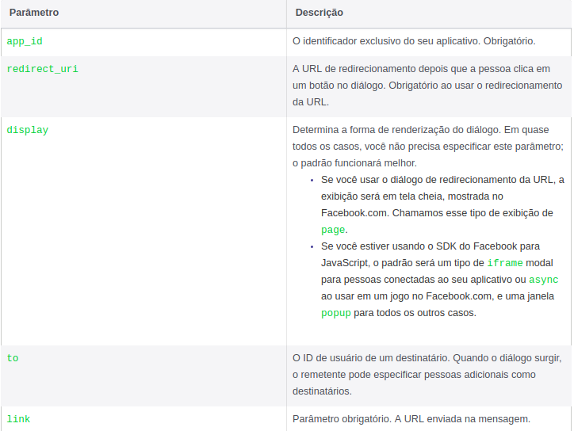

[](https://coveralls.io/github/marcelomoraes28/fbroadrunner?branch=pyramid)
[](https://travis-ci.org/marcelomoraes28/fbroadrunner)
[](https://shields.io)
[](https://shields.io)


# Fbroadrunner


An easy library to help build sharing urls of messages or posts on facebook.

## Getting Started

These instructions will help you install library and use its features.

### Prerequisites

* Python 3
* Pyramid Framework (released)
* Django (released)
* Flask (not implemented)

### Installing

```
pip install fbroadrunner
```

Or you can clone the repository and run

```
pip install -e .
```


## Running the tests
Install test dependencies
```
pip install -e ".[test]"
```

Run test
```
pytest
```

## Using

To start use the library you can setting env FB_APP_ID with your facebook app id.

### Publication parameteres (extracted by [Facebook](https://developers.facebook.com/docs/sharing/reference/feed-dialog))


### Messenger parameters (extracted by [Facebook](https://developers.facebook.com/docs/sharing/reference/send-dialog))



### Pyramid Framework
 
#### Publication examples
Fixed url link

**CODE**
```python
from pyramid.response import Response
from pyramid.view import view_config
from fbroadrunner import pyramid


@view_config(route_name='fb')
@pyramid.fb_publication(redirect_uri='https://mysite.com', link='https://mysite.com')
def fb(request, **kwargs):
    return Response(kwargs.get('fb_url'))
```

Received link by post

**CODE**
```python
from pyramid.response import Response
from pyramid.view import view_config
from fbroadrunner import pyramid


@view_config(route_name='fb')
@pyramid.fb_publication()
def fb(request, **kwargs):
    return Response(kwargs.get('fb_url'))
```
**POST**
```
curl -d "link=https://mysite.com&redirect_uri=https://mysite.com" -X POST http://localhost/fb
```

If you not set FB_APP_ID, you must use

**CODE**
```python
from pyramid.response import Response
from pyramid.view import view_config
from fbroadrunner import pyramid


@view_config(route_name='fb')
@pyramid.fb_publication(app_id=123456789,redirect_uri='https://mysite.com', link='https://mysite.com')
def fb(request, **kwargs):
    return Response(kwargs.get('fb_url'))
```
#### Send messages examples

Fixed url link

**CODE**
```python
from pyramid.response import Response
from pyramid.view import view_config
from fbroadrunner import pyramid


@view_config(route_name='fb')
@pyramid.fb_messenger(redirect_uri='https://mysite.com', link='https://mysite.com')
def fb(request, **kwargs):
    return Response(kwargs.get('fb_url'))
```

If you're using mobile you should use the example below.

**CODE**
```python
from pyramid.response import Response
from pyramid.view import view_config
from fbroadrunner import pyramid


@view_config(route_name='fb')
@pyramid.fb_messenger()
def fb(request, **kwargs):
    return Response(kwargs.get('fb_url'))
```
**POST**
```
curl -d "link=https://mysite.com&redirect_uri=https://mysite.com&is_mobile=True" -X POST http://localhost/fb
```

Fixed endpoint to return a mobile link

**CODE**
```python
from pyramid.response import Response
from pyramid.view import view_config
from fbroadrunner import pyramid


@view_config(route_name='fb')
@pyramid.fb_messenger(mobile=True, redirect_uri='https://mysite.com', link='https://mysite.com')
def fb(request, **kwargs):
    return Response(kwargs.get('fb_url'))
```

### Flask Framework

#### Publication examples

```python
from flask import Flask
from flask import request
from fbroadrunner.flask import fb_publication

app = Flask(__name__)


@app.route('/hello', methods=['GET', 'POST'])
@fb_publication(app_id=1234, request=request, is_json=True)
def login(**kwargs):
    return kwargs['fb_url']
```
#### Send messages examples

```python
from flask import Flask, url_for
from flask import request
from fbroadrunner.flask import fb_messenger

app = Flask(__name__)


@app.route('/hello', methods=['GET', 'POST'])
@fb_messenger(app_id=1234, request=request, is_json=True)
def login(**kwargs):
    return kwargs['fb_url']
```


